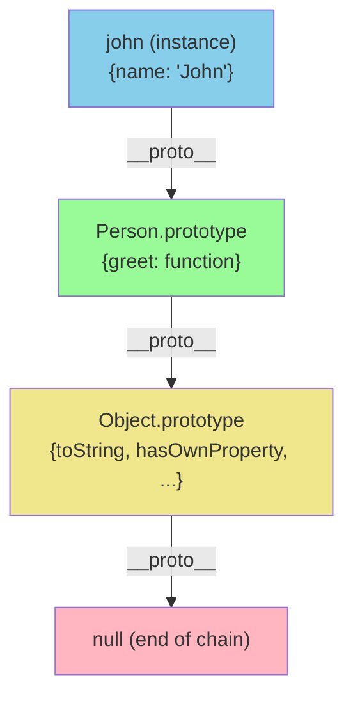
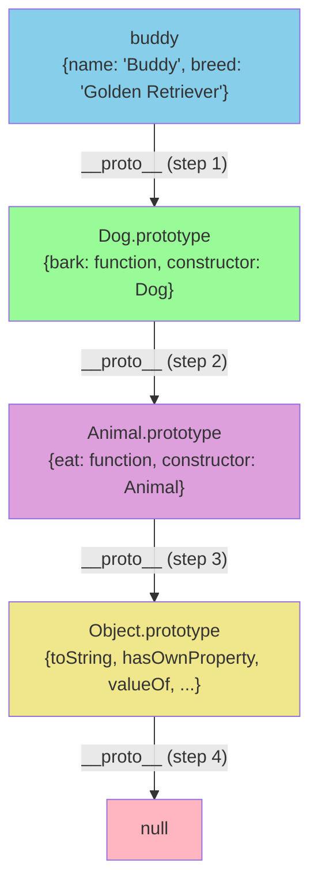
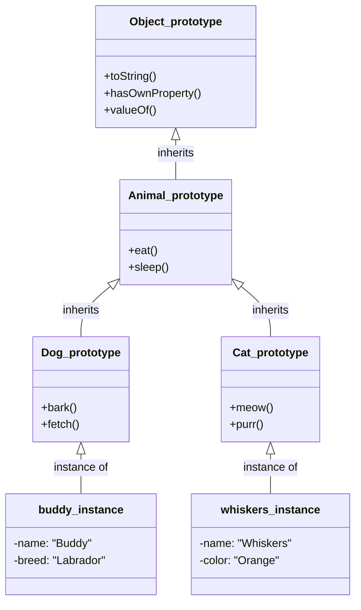
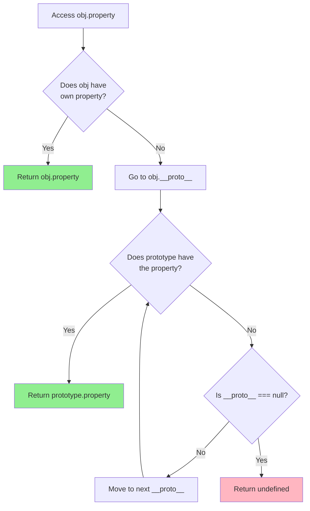
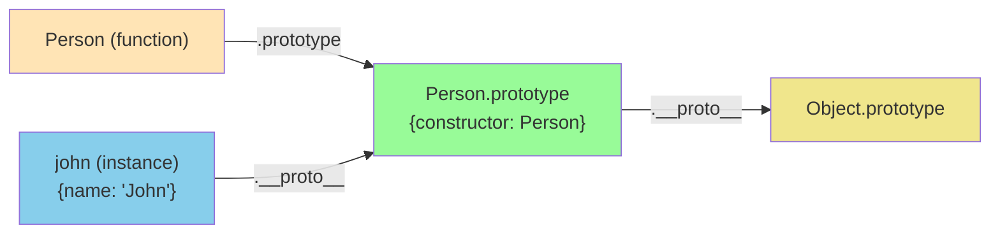
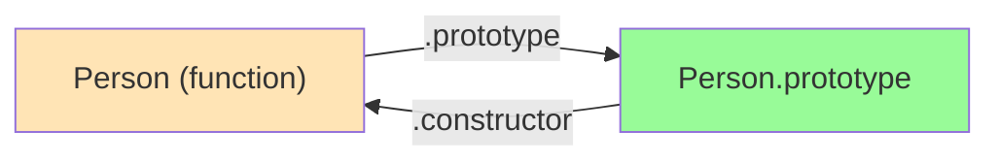
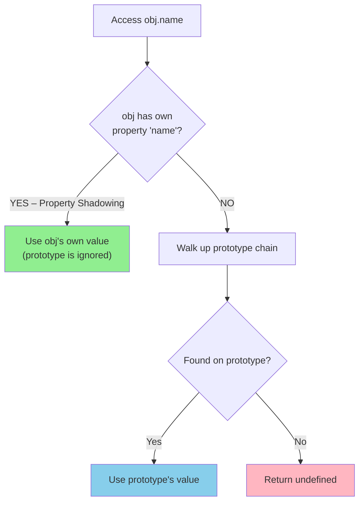

# JavaScript Prototypes

## Q1. What is Prototype in JavaScript?

**Answer:** A **prototype** is an object from which other objects inherit properties and methods. Every JavaScript object has a hidden internal property called `[[Prototype]]` (accessible via `__proto__` or `Object.getPrototypeOf()`) that references another object — its prototype.

- Every **function** has a `prototype` property (used when the function acts as a constructor)
- Every **object** has a `[[Prototype]]` (the link to its parent prototype)

```javascript
function Person(name) {
  this.name = name;
}

// Adding a method to the prototype
Person.prototype.greet = function () {
  return `Hello, I'm ${this.name}`;
};

const john = new Person("John");
const alice = new Person("Alice");

console.log(john.greet()); // "Hello, I'm John"
console.log(alice.greet()); // "Hello, I'm Alice"

// Both instances share the SAME method from the prototype
console.log(john.greet === alice.greet); // true
```

---

## Q2. What is Prototype Chaining?

**Answer:** **Prototype chaining** is the mechanism JavaScript uses to look up properties. When you access a property on an object, JavaScript searches the object itself first, then walks up the prototype chain until the property is found or `null` is reached.

### Prototype Chain Diagram:



### Lookup Order:

1. Check **own properties** of the object
2. Check `__proto__` → **Person.prototype**
3. Check `__proto__.__proto__` → **Object.prototype**
4. Check `__proto__.__proto__.__proto__` → **null** → return `undefined`

```javascript
function Animal(name) {
  this.name = name;
}
Animal.prototype.eat = function () {
  return `${this.name} is eating`;
};

function Dog(name, breed) {
  Animal.call(this, name);
  this.breed = breed;
}

// Set up prototype chain: Dog → Animal → Object
Dog.prototype = Object.create(Animal.prototype);
Dog.prototype.constructor = Dog;

Dog.prototype.bark = function () {
  return `${this.name} says Woof!`;
};

const buddy = new Dog("Buddy", "Golden Retriever");

// Chain lookup in action
console.log(buddy.bark()); // Found on Dog.prototype
console.log(buddy.eat()); // Found on Animal.prototype
console.log(buddy.toString()); // Found on Object.prototype

// Verifying the chain
console.log(buddy.__proto__ === Dog.prototype); // true
console.log(buddy.__proto__.__proto__ === Animal.prototype); // true
console.log(buddy.__proto__.__proto__.__proto__ === Object.prototype); // true
console.log(buddy.__proto__.__proto__.__proto__.__proto__ === null); // true
```

### Detailed Chain Diagram:



---

## Q3. What is Prototype Inheritance?

**Answer:** **Prototypal inheritance** is JavaScript's mechanism for objects to inherit properties and methods from other objects via the prototype chain. Unlike classical inheritance (Java, C++), JavaScript does not use classes internally — even ES6 `class` is syntactic sugar over prototypes.

### Inheritance Diagram:



### Three Ways to Set Up Inheritance:

**1. Constructor Pattern:**

```javascript
function Vehicle(type) {
  this.type = type;
}
Vehicle.prototype.move = function () {
  return `${this.type} is moving`;
};

function Car(brand) {
  Vehicle.call(this, "Car"); // inherit properties
  this.brand = brand;
}
Car.prototype = Object.create(Vehicle.prototype); // inherit methods
Car.prototype.constructor = Car;

const myCar = new Car("Toyota");
console.log(myCar.move()); // "Car is moving" (inherited)
```

**2. Object.create():**

```javascript
const animal = {
  eat() {
    return `${this.name} is eating`;
  },
};

const dog = Object.create(animal);
dog.name = "Buddy";
dog.bark = function () {
  return `${this.name} says Woof!`;
};

console.log(dog.eat()); // "Buddy is eating" (inherited)
console.log(dog.bark()); // "Buddy says Woof!" (own method)
```

**3. ES6 Classes (syntactic sugar):**

```javascript
class Shape {
  constructor(color) {
    this.color = color;
  }
  describe() {
    return `A ${this.color} shape`;
  }
}

class Circle extends Shape {
  constructor(color, radius) {
    super(color);
    this.radius = radius;
  }
  area() {
    return Math.PI * this.radius ** 2;
  }
}

const c = new Circle("red", 5);
console.log(c.describe()); // "A red shape" (inherited)
console.log(c.area()); // 78.54 (own method)
```

---

## Q4. How the Prototype Chain Works in JavaScript

**Answer:** When a property or method is accessed on an object, JavaScript follows this lookup flow:



```javascript
function Foo() {}
Foo.prototype.x = 10;

const obj = new Foo();
obj.y = 20;

console.log(obj.y); // 20 — found on the object itself
console.log(obj.x); // 10 — not on obj, found on Foo.prototype
console.log(obj.z); // undefined — not found anywhere in the chain
```

---

## Q5. What is the Difference Between `prototype` and `__proto__`?

**Answer:** These are two different things that are often confused:

- **`prototype`** is a property on **functions**. It is the object that will become the `__proto__` of instances created with `new`.
- **`__proto__`** is a property on **every object**. It points to the prototype from which the object inherits.

| Aspect           | `prototype`                                | `__proto__`                                     |
| ---------------- | ------------------------------------------ | ----------------------------------------------- |
| **Exists on**    | Functions only                             | Every object                                    |
| **Purpose**      | Blueprint for instances created with `new` | Link to parent prototype                        |
| **Accessed via** | `Function.prototype`                       | `obj.__proto__` or `Object.getPrototypeOf(obj)` |
| **Writable**     | Yes                                        | Yes (but avoid in production)                   |

```javascript
function Person(name) {
  this.name = name;
}

const john = new Person("John");

// prototype lives on the function
console.log(Person.prototype); // { constructor: Person }

// __proto__ lives on the instance and points TO Person.prototype
console.log(john.__proto__ === Person.prototype); // true

// The function itself also has __proto__ (it's an object too!)
console.log(Person.__proto__ === Function.prototype); // true
```

### Diagram:



---

## Q6. What is the Difference Between `prototype` and `constructor`?

**Answer:**

- **`prototype`** is a property on functions that holds the shared methods/properties for instances.
- **`constructor`** is a property on the prototype object that points back to the function that created it.

They form a **circular reference**:



```javascript
function Person(name) {
  this.name = name;
}

// Circular reference
console.log(Person.prototype.constructor === Person); // true

const john = new Person("John");
console.log(john.constructor === Person); // true (inherited from prototype)

// constructor can be used to create new instances from existing ones
const clone = new john.constructor("Clone");
console.log(clone.name); // "Clone"
```

---

## Q7. What is the Difference Between `prototype` and `class`?

**Answer:** ES6 `class` is **syntactic sugar** over prototype-based inheritance. Under the hood, classes use exactly the same prototype mechanism.

| Aspect              | Prototype Pattern                   | Class Syntax            |
| ------------------- | ----------------------------------- | ----------------------- |
| **Syntax**          | Verbose, manual setup               | Clean, familiar syntax  |
| **Under the hood**  | Prototype chain                     | Prototype chain (same!) |
| **Hoisting**        | Function declarations are hoisted   | Classes are NOT hoisted |
| **Strict mode**     | Optional                            | Always strict           |
| **`super` keyword** | Not available (`Parent.call(this)`) | Built-in                |

```javascript
// --- Prototype Pattern ---
function Animal(name) {
  this.name = name;
}
Animal.prototype.speak = function () {
  return `${this.name} makes a sound`;
};

// --- Class Syntax (equivalent) ---
class AnimalClass {
  constructor(name) {
    this.name = name;
  }
  speak() {
    return `${this.name} makes a sound`;
  }
}

// Both work the same way under the hood
const a1 = new Animal("Dog");
const a2 = new AnimalClass("Cat");

console.log(typeof Animal); // "function"
console.log(typeof AnimalClass); // "function" — classes ARE functions!
console.log(a2.__proto__ === AnimalClass.prototype); // true
```

---

## Q8. How is a Value Accessed From Prototype — Present vs Not Present on the Object?

**Answer:** JavaScript uses **shadowing**: if a property exists on the object itself, it is used directly. If not, JavaScript walks up the prototype chain.

### Diagram:



### Example:

```javascript
function Person(name) {
  this.name = name;
}
Person.prototype.name = "Default";
Person.prototype.role = "User";

const john = new Person("John");

// CASE 1: Property EXISTS on the object — own property wins (shadowing)
console.log(john.name); // "John" — found on john itself, prototype ignored

// CASE 2: Property DOES NOT EXIST on the object — prototype is used
console.log(john.role); // "User" — not on john, found on Person.prototype

// CASE 3: Property does not exist anywhere
console.log(john.age); // undefined — not on john or any prototype

// Verify with hasOwnProperty
console.log(john.hasOwnProperty("name")); // true (own property)
console.log(john.hasOwnProperty("role")); // false (inherited)
```

### Deleting an Own Property Reveals the Prototype Value:

```javascript
const john = new Person("John");

console.log(john.name); // "John" (own property)

delete john.name; // remove the own property

console.log(john.name); // "Default" (now falls through to prototype)
```

---

## 💡 Quick Tips

- **`prototype`** = property on functions, the blueprint for instances
- **`__proto__`** = property on objects, the link to the parent prototype
- **Prototype chain** = the linked series of `__proto__` references
- Use `Object.getPrototypeOf()` instead of `__proto__` in production
- Own properties **shadow** (override) prototype properties
- Every chain ends at `Object.prototype → null`
- ES6 `class` is syntactic sugar — it still uses prototypes
