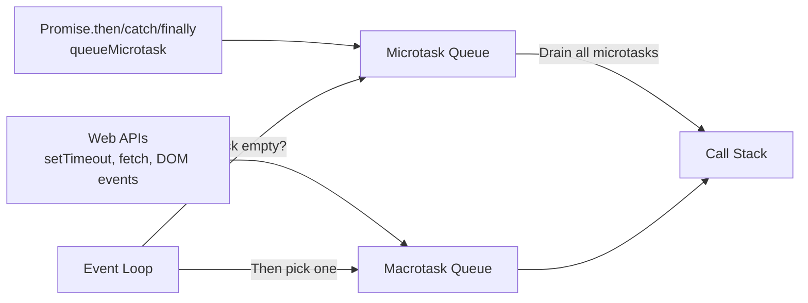
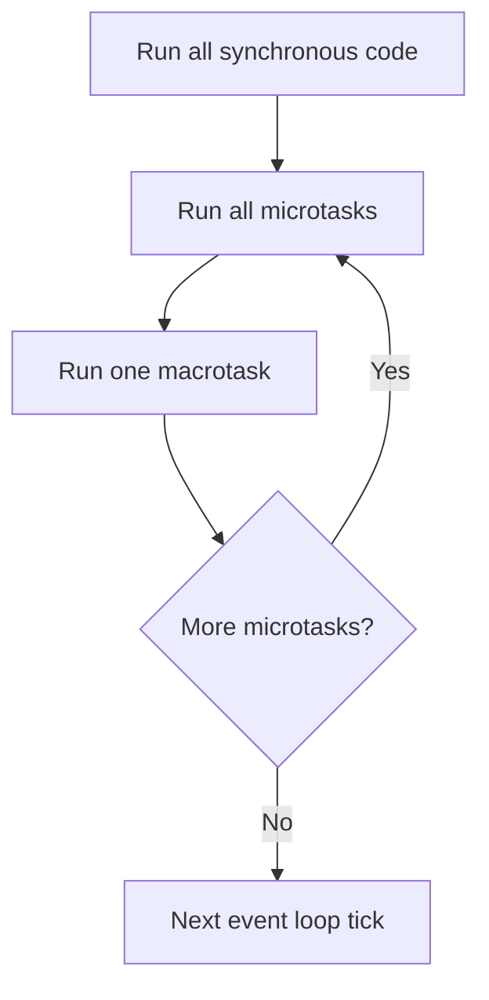

## JavaScript Event Loop, Call Stack, Queue, Microtask, and Macrotask

This note explains how JavaScript handles asynchronous code and common interview questions around execution order.

---

## 1) What is the Call Stack?

The **call stack** is a LIFO (Last In, First Out) structure where JavaScript keeps track of function execution.

- When a function is called, it is pushed onto the stack.
- When it returns, it is popped off.
- JavaScript executes one thing at a time on the main thread.

```javascript
function one() {
  two();
  console.log("one");
}

function two() {
  console.log("two");
}

one();
// Output:
// two
// one
```

---

## 2) What is the Queue?

Queue stores async callbacks that are ready to run after the call stack becomes empty.

There are two important queues:

- **Macrotask queue** (task queue): `setTimeout`, `setInterval`, I/O, UI events.
- **Microtask queue**: `Promise.then/catch/finally`, `queueMicrotask`, MutationObserver.

---

## 3) What is the Event Loop?

The **event loop** continuously checks:

1. Is call stack empty?
2. If yes, run all pending **microtasks**.
3. Then run one **macrotask**.
4. Repeat.

Rule to remember:

**Synchronous code → Microtasks → Macrotask**

### Visual: Event Loop Architecture



### Visual: Execution Priority



---

## 4) Microtask vs Macrotask (with example)

```javascript
console.log("start");

setTimeout(() => {
  console.log("setTimeout");
}, 0);

Promise.resolve().then(() => {
  console.log("promise");
});

console.log("end");
```

**Output:**

```text
start
end
promise
setTimeout
```

Why?

- `start`, `end` are synchronous.
- `Promise.then` callback goes to microtask queue.
- `setTimeout` callback goes to macrotask queue.
- Event loop runs microtasks first.

---

## 5) How Promise and setTimeout work together

`Promise` callbacks are microtasks, so they run before `setTimeout` callbacks (macrotasks), even when `setTimeout(..., 0)` is used.

```javascript
setTimeout(() => console.log("timeout 1"), 0);

Promise.resolve()
  .then(() => console.log("promise 1"))
  .then(() => console.log("promise 2"));

setTimeout(() => console.log("timeout 2"), 0);
```

**Output:**

```text
promise 1
promise 2
timeout 1
timeout 2
```

All microtasks are drained before taking the next macrotask.

---

## 6) Tricky Output-Based Questions

## Q1) Output?

```javascript
console.log("A");

setTimeout(() => console.log("B"), 0);

Promise.resolve().then(() => console.log("C"));

console.log("D");
```

**Answer:**

```text
A
D
C
B
```

---

## Q2) Output?

```javascript
console.log(1);

setTimeout(() => {
  console.log(2);
  Promise.resolve().then(() => console.log(3));
}, 0);

Promise.resolve().then(() => console.log(4));

console.log(5);
```

**Answer:**

```text
1
5
4
2
3
```

Reason:

- Main sync: `1`, `5`
- Microtask: `4`
- Macrotask: `2`
- Microtask created inside timeout: `3`

---

## Q3) Output?

```javascript
console.log("start");

queueMicrotask(() => console.log("micro 1"));

Promise.resolve().then(() => {
  console.log("micro 2");
  setTimeout(() => console.log("macro from micro"), 0);
});

setTimeout(() => console.log("macro 1"), 0);

console.log("end");
```

**Answer:**

```text
start
end
micro 1
micro 2
macro 1
macro from micro
```

---

## 7) Interview Questions and Answers

**Q: Why does Promise run before setTimeout?**  
A: Promise callbacks are microtasks; event loop processes microtasks before macrotasks.

**Q: Does `setTimeout(fn, 0)` run immediately?**  
A: No. It schedules a macrotask; it runs only after current stack and microtasks complete.

**Q: What is starvation in event loop?**  
A: If microtasks keep adding more microtasks, macrotasks can get delayed.

**Q: Is JavaScript single-threaded?**  
A: JavaScript execution is single-threaded, but browser/Node APIs handle async work outside the main call stack.

**Q: Which queue has higher priority?**  
A: Microtask queue has higher priority than macrotask queue.

---

## 8) Rapid Fire Revision

- Call stack executes synchronous code.
- Event loop runs when stack is empty.
- Microtasks: Promise callbacks, `queueMicrotask`.
- Macrotasks: `setTimeout`, `setInterval`, events, I/O.
- Order: sync → microtasks → one macrotask → repeat.
- `setTimeout(..., 0)` is not immediate.
