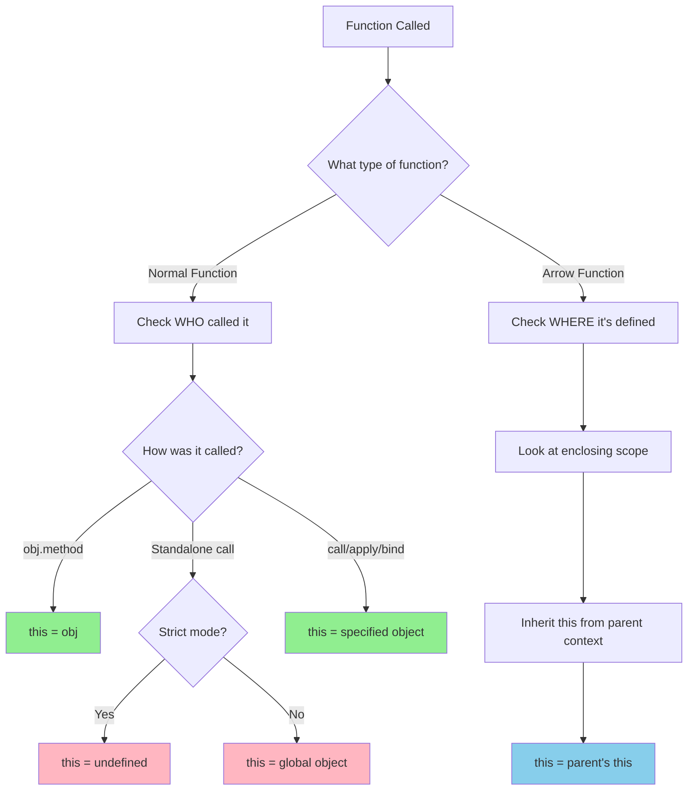

# Q1. What is the difference between function and method in JavaScript?

## Key Differences

### Function

A **function** is an independent block of code that can be called directly by its name. It's a standalone, reusable piece of code.

```javascript
// Function Declaration
function greet(name) {
  return `Hello, ${name}!`;
}

// Function Expression
const add = function (a, b) {
  return a + b;
};

// Arrow Function
const multiply = (a, b) => a * b;

// Calling functions
console.log(greet("Alice")); // "Hello, Alice!"
console.log(add(2, 3)); // 5
console.log(multiply(4, 5)); // 20
```

### Method

A **method** is a function that is associated with an object. It's a property of an object whose value is a function.

```javascript
const person = {
  name: "John",
  age: 30,
  // Method: function inside an object
  greet: function () {
    return `Hello, I'm ${this.name}`;
  },
  // ES6 shorthand method syntax
  sayAge() {
    return `I am ${this.age} years old`;
  },
};

// Calling methods
console.log(person.greet()); // "Hello, I'm John"
console.log(person.sayAge()); // "I am 30 years old"
```

## Comparison Table

| Aspect             | Function                                    | Method                             |
| ------------------ | ------------------------------------------- | ---------------------------------- |
| **Definition**     | Standalone code block                       | Function associated with an object |
| **Invocation**     | `functionName()`                            | `object.methodName()`              |
| **`this` context** | Global object (or undefined in strict mode) | The object that owns the method    |
| **Location**       | Defined independently                       | Defined as object property         |

## Understanding `this` Context

The main difference becomes clear when using the `this` keyword:

```javascript
// Function - 'this' refers to global object (window in browser)
function showThis() {
  console.log(this);
}

showThis(); // Window object (or undefined in strict mode)

// Method - 'this' refers to the object
const obj = {
  name: "MyObject",
  showThis: function () {
    console.log(this);
  },
};

obj.showThis(); // { name: "MyObject", showThis: [Function] }
```

## Converting Between Function and Method

```javascript
// A function can become a method when assigned to an object
function introduce() {
  return `My name is ${this.name}`;
}

const user1 = {
  name: "Alice",
  introduce: introduce, // Function becomes a method
};

const user2 = {
  name: "Bob",
  introduce: introduce,
};

console.log(user1.introduce()); // "My name is Alice"
console.log(user2.introduce()); // "My name is Bob"
```

## Q2. What is the value of `this` inside a function?

**Answer:** In strict mode, the value of `this` is `undefined` when a function is called as a standalone function. However, in non-strict mode, due to the `this substitution` rule, the value of `this` becomes the global object.

```javascript
"use strict";
function showThis() {
  console.log(this);
}

showThis(); // undefined (strict mode)
```

```javascript
// Non-strict mode
function showThis() {
  console.log(this);
}

showThis(); // global object (Window in browsers, global in Node.js)
```

## Q3. What is global `this`?

**Answer:** The global `this` refers to the global object in JavaScript, which varies depending on the environment:

- **In browsers:** `window` object
- **In Node.js:** `global` object (in older versions) or `globalThis` (in newer versions)
- **In Web Workers:** `self` object
- **Universal (ES2020+):** `globalThis` provides a standard way to access the global object across all environments

```javascript
// Browser environment
console.log(this === window); // true (at global scope)

// Node.js environment
console.log(this === global); // true (at global scope in older Node.js)

// Universal approach (ES2020+)
console.log(globalThis); // Works in all environments
```

## Q4. What is the `this substitution` rule?

**Answer:** The `this substitution` rule (also known as `this` binding default rule) states that when `this` is `undefined` or `null` in non-strict mode, JavaScript automatically substitutes it with the global object. This prevents `this` from being `undefined` or `null` in non-strict mode.

**In non-strict mode:**

- If `this` is `undefined` → substituted with global object
- If `this` is `null` → substituted with global object

**In strict mode:**

- `this` substitution does NOT happen
- `this` remains `undefined` if it's `undefined`
- `this` remains `null` if it's `null`

```javascript
// Non-strict mode example
function regularFunction() {
  console.log(this); // global object (due to this substitution)
}

regularFunction();

// Strict mode example
("use strict");
function strictFunction() {
  console.log(this); // undefined (no substitution)
}

strictFunction();
```

**Real-world example:**

```javascript
const obj = {
  name: "MyObject",
  method: function () {
    console.log(this);
  },
};

const extractedMethod = obj.method;

// Non-strict mode
extractedMethod(); // global object (this substitution occurs)

// Strict mode
("use strict");
extractedMethod(); // undefined (no substitution)
```

## Q5. Rule to Find the Value of `this` in a Function

**Answer:** The value of `this` depends on the type of function:

### Normal Function

For a **normal function** (regular function, function declaration, or function expression), the value of `this` is determined by **how the function is called** (the object that invokes it).

### Arrow Function

For an **arrow function**, the value of `this` is determined by the **lexical environment** (the surrounding context where the arrow function is defined). Arrow functions do not have their own `this` binding and inherit it from the enclosing scope.

### Example: Arrow Function Inheriting `this`

```javascript
const obj2 = {
  name: "Amarendra",
  show: function () {
    const x = () => {
      console.log(this); // Logs obj2 because arrow functions inherit `this` from the enclosing  lexical context
    };
    x();
  },
};

obj2.show(); // Output: { name: "Amarendra", show: [Function: show] }
```

**Explanation:**

- The `show` method is a normal function, so its `this` refers to `obj2` (the object that called it)
- The arrow function `x` does not have its own `this`, so it inherits `this` from its enclosing context (the `show` method)
- Therefore, `this` inside the arrow function `x` also refers to `obj2`

### Comparison: Normal Function vs Arrow Function

```javascript
const obj3 = {
  name: "Test",
  normalFunc: function () {
    console.log(this); // `this` refers to obj3
  },
  arrowFunc: () => {
    console.log(this); // `this` refers to the outer scope (global or undefined in strict mode)
  },
};

obj3.normalFunc(); // Output: { name: "Test", normalFunc: [Function], arrowFunc: [Function] }
obj3.arrowFunc(); // Output: global object or undefined (depending on strict mode)
```

### Nested Example: Normal Function Inside Arrow Function

```javascript
const obj4 = {
  name: "Nested Example",
  outerArrow: () => {
    const innerNormal = function () {
      console.log(this); // `this` depends on how innerNormal is called
    };
    innerNormal(); // Called as standalone, so `this` is global/undefined
  },
};

obj4.outerArrow();
```

## 💡 Quick Tips for `this`

### Remember This Simple Rule:

- **Normal Function:** `this` = **WHO** is calling the function
- **Arrow Function:** `this` = **WHERE** the function is defined (lexical location)

### Diagram: How `this` is Determined



### Visual Summary:

```javascript
// Normal Function: WHO called it?
const obj = {
  name: "Object",
  method: function () {
    console.log(this); // ← WHO called it? obj.method() → `this` is obj
  },
};

obj.method(); // obj called it, so `this` = obj

// Arrow Function: WHERE is it defined?
const obj2 = {
  name: "Object",
  method: function () {
    // ← Arrow function defined HERE, inside this method
    const arrow = () => {
      console.log(this); // WHERE defined? Inside method → `this` = obj2
    };
    arrow();
  },
};

obj2.method(); // Arrow inherits `this` from WHERE it was defined
```
